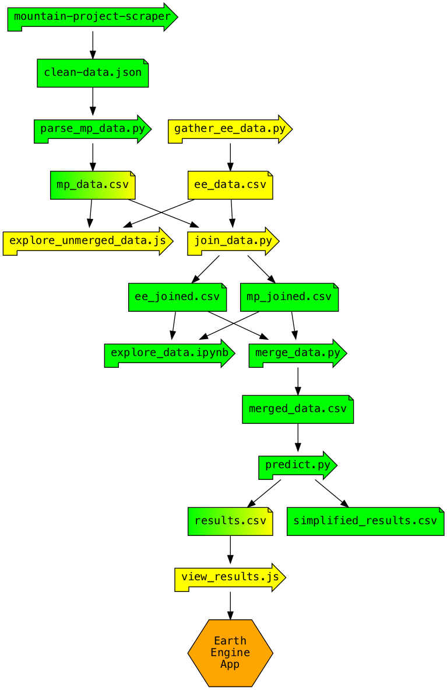

# big-wall-finder

>Apply machine learning to geographic data to discover big walls.

[View the results here.]()

## Motivation

Stumbling upon an undiscovered boulder field or coming across an uncharted cliff is a source of great inspiration for rock climbers: It is exciting to climb a rock formation that has never previously been climbed. Some climbers consider this act of "rock-pioneering" as the pinnacle of their craft. Climbers who explore, prepare, and establish new climbing routes are known within the community as *route developers*. These developers spend months or years of their lives combing through under-explored terrain that might lend itself to rock climbing.

This project attempts to leverage geographic data to help identify terrain in the continental United States which may be of interest to route developers. In particular, this project uses elevation, geologic, and satellite data, along with user-generated content, to predict which unexplored terrain has potential for climbing.

## Summary

At a high-level, this project:

1. Analyzes elevation data to identify cliff-like formations.
1. Extracts geographic *features* for each discovered cliff, such as geologic and satellite data.
1. Extracts user-generated rock climbing data from the collaborative online guidebook [Mountain Project](https://www.mountainproject.com/).
1. Applies machine learning algorithms to model the rock climbing potential of a cliff based on the extracted data.
1. Predicts which unexplored cliffs have the best potential for rock climbing.

See [Methodolgy](#methodology) for details, and see [Pipeline](#pipeline) for visual representation of the flow of data within this project.

## Screenshots

Exploring the correspondence between Mountain Project areas (green dots) and cliff-like formations found with Earth Engine (yellow-red bands).


## Technologies

Languages, APIs, and libraries include:

- Python (pandas, scikit-learn, XGBoost, TensorFlow)
- [Google Earth Engine](https://developers.google.com/earth-engine) (JavaScript and Python APIs)
- [mountain-project-scraper](https://github.com/alexcrist/mountain-project-scraper) (Node.js)

Datasets include:

- [USGS National Elevation Dataset 1/3 arc-second](https://developers.google.com/earth-engine/datasets/catalog/USGS_NED)
- [US Lithology](https://developers.google.com/earth-engine/datasets/catalog/CSP_ERGo_1_0_US_lithology
)
- [Landsat 8](https://developers.google.com/earth-engine/datasets/catalog/landsat-8)
- [Mountain Project Route Database](https://www.mountainproject.com/route-guide)

## How to Use

The results of project can be viewed through an [interactive map](). The data generated at various stages of this project are available within the `data/` directory of this repo. Several files are of interest:

- [ee_data.csv](data/ee_data.csv) contains the raw data generated by [gather_ee_data.py](src/gather_ee_data.py). This script uses elevation data to find cliff-like formations in the western continental United States (west of longitude line defining the Colorado-Kansas border). This database contain geologic and satellite data for each cliff as well as a polygon defining its coordinates. This script ran for at least 10 hours on Google Cloud servers.
- [mp_data.csv](data/mp_data.csv) was generated by [parse_mp_data.py](src/parse_mp_data.py). It holds Mountain Project route data aggregated by geographic coordinates. The Mountain Project data were scraped with [mountain-project-scraper](https://github.com/alexcrist/mountain-project-scraper).
- Various machine learning models were used to make predictions. A short list of results can be seen in [simplified_results.csv](data/simplified_results.csv). The file [results.csv](data/results.csv) contains GeoJSON Polygons defining the footprint of each cliff. This file is rendered in the [interactive map]().

The script [predict.py](src/predict.py) implements several of the standard machine learning algorithms such as k-nearest neighbors, gradient tree boosting, and random forest. Because the dataset we use for training is not particularly large (~10k data points), deep learning techniques are limited. All of the models used in this project train quickly and can readily be re-tuned.

## Pipeline

Because we are combining data from several different sources, the data pipeline is involved. Below is a basic [graph](https://www.graphviz.org/) showing the relationship between scripts and data files. Yellow indicates that a script runs on or an asset is stored in the Google Earth Engine cloud. Green indicates local execution or storage. Data files given both colors are used both locally and in the cloud.



## Methodology

### Cliff-like formations

We start with elevation data to identify connected regions of steep terrain. Elevation data is an example of *raster* object: it is comprised of a huge number of pixels organized by some grid-like geometry.

To find steep terrain, we set two thresholds: a height threshold and a slope threshold. A *cliff-like formation* is defined by an 8-connected region in which

- all pixels within the region have slope at least as large as the slope threshold, and
- the total elevation change of the region is at least as large as the height threshold.

These cliff-like formations (CLFs) are the central objects of study in this project. Each CLF can be "vectorized" and extracted as a GeoJSON Polygon object.

The collection of CLFs will include any sufficiently tall and sufficiently steep cliff of interest to rock climbers. That said, the overwhelming majority of CLFs found will be *false positives*: climbers would never dream of venturing into these regions. In addition to containing the best big walls of Yosemite Valley, CLFs include steep unconsolidated scree fields, loose chossy sandstone layers similar to those in the Grand Canyon, jagged exfoliating alpine spires, and other weird anomalies arising from noise in the data.

### Extracting features from each CLF

To distinguish between CLFs which have rock climbing potential from those which don't, we collect geologic data from the US Lithology database as well as satellite data from the Landsat 8 database.

- US Lithology. For each CLF, we extract the proportion of pixels in a disk surrounding the cliff labeled:
  - non carbonate material
  - silicic residual material
  - colluvial sediment material
  - glacial till coarse material
  - alluvium material.
- Landsat 8. For each CLF, we extract the median-value of the pixels contained within the CLF footprint in each of the following bands:
  - B2
  - B4
  - B5
  - B6
  - B7
  - the ratio B4 / B2
  - the ratio B6 / B5
  - the ratio B6 / B7.

Choosing to extract this particular collection of features was informed by exploring the lithology-values of CLFs and by emulating the process by which geologists [classify geologic formations](https://www.arcgis.com/home/item.html?id=9f9d2f7b6460497c9cbb9548d4ec0bc8) with Landsat 8 data.

In addition, for each CLF we calculate a *score* based on user-generated content on Mountain Project. This score is computed by taking a weighted sum of the number of routes and the number of page-views of those routes in a neighborhood of the CLF. The score provides a measure of rock-climbing quality: we expect CLFs with a high score to have quality climbing. CLFs that are not in close proximity with any Mountain Project entry receive a score of zero.

We consider two situations in which a CLF has no presence on Mountain Project:

- The CLF has already been explored and no quality climbing exists.
- The CLF has not yet been thoroughly explored.

### A function to learn

We want to consider those CLFs that have been explored by climbers. Any CLF with a Mountain Project entry has been explored. In addition, we make the assumption that any CLF sufficiently close to a major Mountain Project climbing area has been explored. We also assume that any CLF close to a population center and a road has been explored.

In more detail, we call a CLF *accessible* if is within some distance threshold of a Mountain Project area or if it is sufficiently close to a road and a large population center. The precise threshold for closeness is unimportant at the moment, and can be fine-tuned later on. We make the assumption that any accessible CLF has already been explored for climbing. Therefore, an accessible CLF not present on Mountain Project has no potential for climbing. With this assumption in place, the score derived from Mountain Project data gives a perfect measure of the quality of accessible CLFs.

For each accessible CLF, let X be the aforementioned geographic data pertaining to the CLF, and let y be the score of the CLF. We now have a machine learning problem: We seek to approximate the function which associates X to y.

Once this function is learned, we then apply it to the collection of inaccessible CLFs to predict their scores. The CLFs with a high predicted score and without a Mountain Project entry may have undiscovered or little-known rock climbing potential.

An aside. This function is likely highly nonlinear. Most cliff bands contain loose rock not amenable for climbing. The conditions that make a cliff well suited for climbing vary depending on rock type and terrain properties. Indeed, imagine two of the most iconic big walls in the country: Moonlight Buttress in Zion National Park and El Capitan in Yosemite. Now, imagine a cliff with geographic data corresponding to the average of Moonlight Buttress and El Capitan. We don't expect the average of the Landsat bands of water-eroded sandstone and glacially polished granite to produce anything meaningful. As a consequence, this function is nonlinear.

### Constraints and Limitations

Beyond our major assumption ACCESSIBLE = COMPLETE, we list several other defects of our approach.

- The USGS Elevation dataset is coarse. The pixel resolution of this raster data is roughly 10m x 10m. Said differently, elevation is sampled only one in each 10m x 10m square on the earth's surface. As a consequence, it is not possible to identify steep but short cliffs using this dataset. For example, a vertical cliff that is exactly 10m tall will appear as a 45 degree slab from the perspective of this dataset. Once lidar data become more widely available, this could be used in place of the USGS Elevation dataset. With lidar data, it might be possible to detect "small wall" climbing in addition to big wall climbing. This project will not detect CLFs under 100m in height.
- The USGS Elevation dataset is noisy. As an extreme example, the dataset (used within Google Maps for the terrain layer) shows a [4000 foot deep X-shaped hole](https://goo.gl/maps/HTCByKHDRR2GjdheA) in the ground in the middle of the desert. In another arbitrary location, we have a [nearly 5000 foot deep well](https://goo.gl/maps/KDranmgbPAi18pzh9). These glitches are drastic, but rare. More commonly, spikey non-smooth terrain gives rise to highly volatile elevation readings. Mistakes within the elevation data should be scrubbed from the dataset if possible. We attempt this in the [clean_data.py](src/clean_data.py) script.
- Mountain Project data are incomplete. In some sense, this project would not exist if the Mountain Project corpus was a complete data set. Nevertheless, having stronger Mountain Project data may allow us to weaken our ACCESSIBLE = COMPLETE assumption and yield better results.
- Within the accessible CLFs data, there is a significant imbalance: most accessible CLFs have no entry on Mountain Project. There are standard techniques to account for this (oversampling the under-represented class), but it may not be possible to completely remove bias from the model.
- The collection of CLFs [ee_data.csv](data/ee_data.csv) is small. The dataset of Mountain Project routes [mp_data.csv](data/mp_data.csv) is small. Prediction accuracy is limited by the size of these datasets.
- In searching for CLFs with specific properties, handcrafting features may give stronger results than machine learning models. If a route developer only sought Yosemite-style granite, they could first examine the geological spectrum of Yosemite granite, then filter CLFs by the targeted spectrum.
- In reality, the distinction between a CLF being explored or not explored is not binary. There are many cliff that would appeal to some climbers but not others. It is certainly not true to assume that every explored CLF with high quality climbing is listed on Mountain Project. Conversely, there are some CLFs on Mountain Project with very little quality climbing. Beauty is in the eye of the beholder.

### Results

## Earth Engine

Google Earth Engine is a tool for exploring and visualizing GIS data. The [API](https://github.com/google/earthengine-api) provides a library and framework for running calculations on Google cloud servers, and includes both Python and JavaScript wrapper functions. The API uses a functional programming paradigm and includes custom highly optimized containers for performing calculations with raster and vector geographic data. Functions within the `ee` namespace run server-side.

As a small example of this, the following snippet imports the US elevation dataset and applies a filter so that only pixels in which the terrain slope is at least 80 degrees is left unmasked.

```python
dem = ee.Image('USGS/NED')
steep = ee.Terrain.slope(dem).gt(80)
dem = dem.updateMask(steep)
```

## License

This project is released under the [MIT license](https://opensource.org/licenses/MIT).
